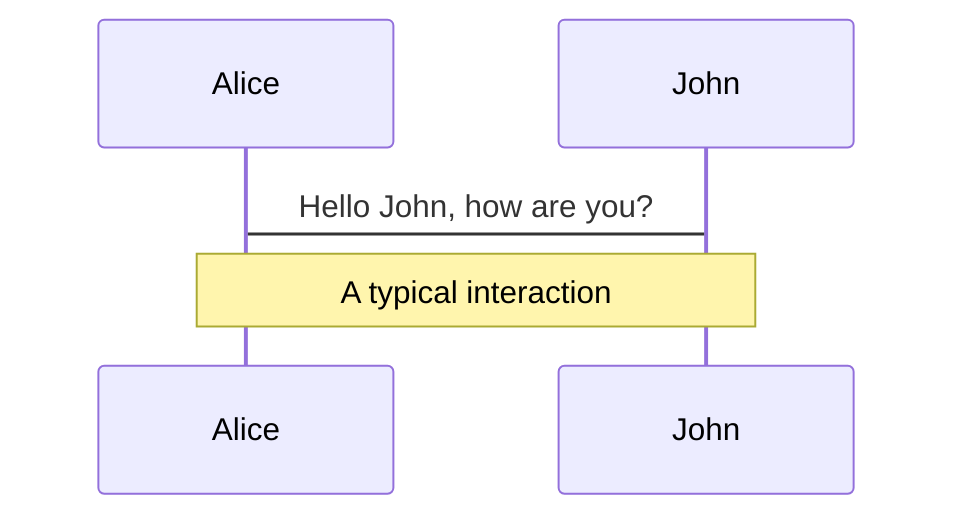
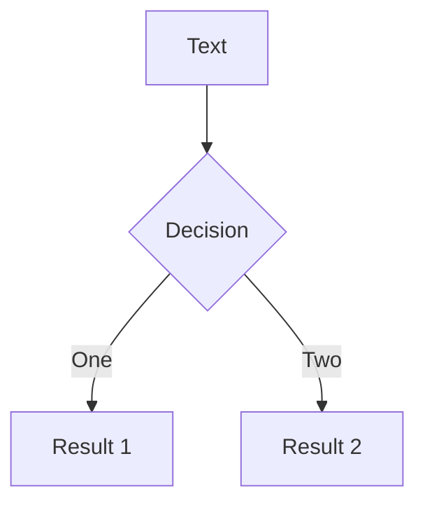
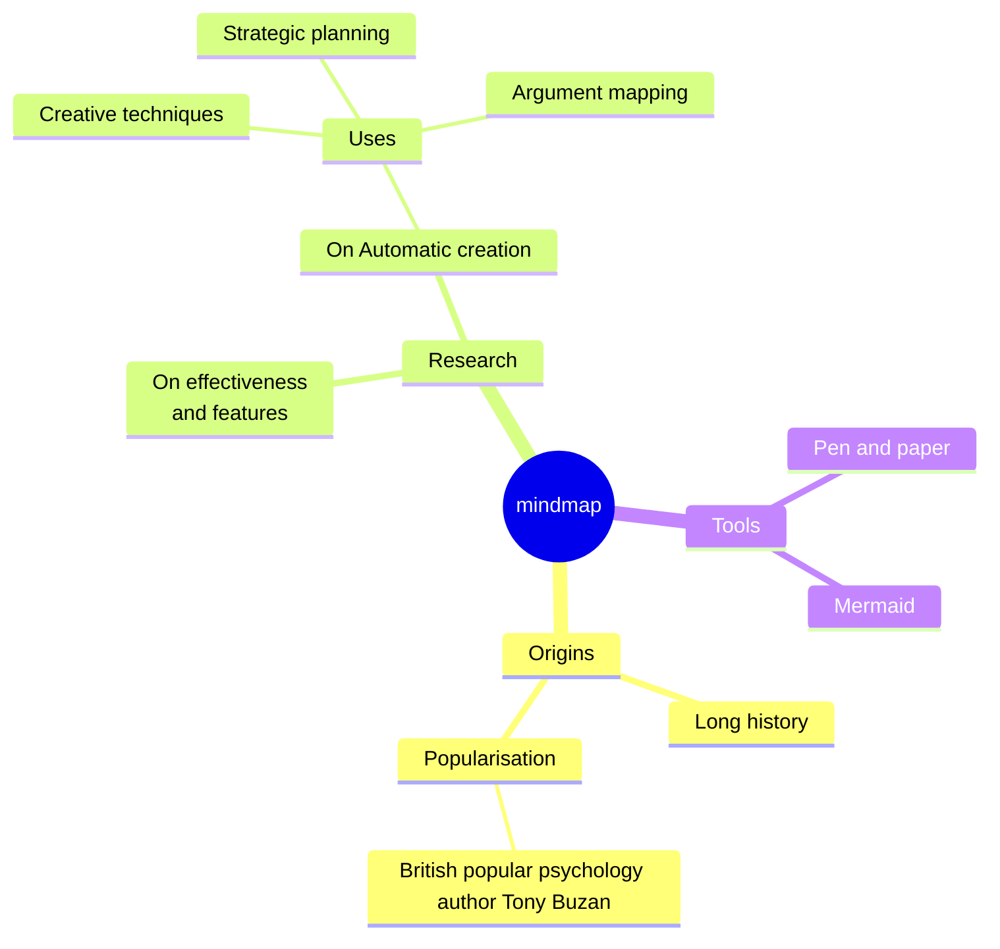
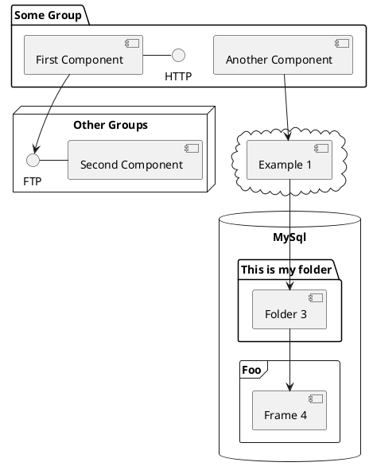

---
# You can also start simply with 'default'
theme: seriph
# random image from a curated Unsplash collection by Anthony
# like them? see https://unsplash.com/collections/94734566/slidev
# background: https://cover.sli.dev
# some information about your slides (markdown enabled)
title: Nixing your system
info: |
  ## A guide to fun and profit
# apply unocss classes to the current slide
class: text-center
# https://sli.dev/custom/highlighters.html
highlighter: shiki
# https://sli.dev/guide/drawing
drawings:
  persist: false
# slide transition: https://sli.dev/guide/animations#slide-transitions
transition: slide-left
# enable MDC Syntax: https://sli.dev/guide/syntax#mdc-syntax
mdc: true
---

# Nixing your system

A guide to fun and profit

<div class="pt-12">
  <!-- <span @click="$slidev.nav.next" class="px-2 py-1 rounded cursor-pointer" hover="bg-white bg-opacity-10">
    Press Space for next page <carbon:arrow-right class="inline"/>
  </span> -->
</div>

<div class="abs-br m-6 flex gap-2">
  <a href="https://github.com/slidevjs/slidev" target="_blank" alt="GitHub" title="Open in GitHub"
    class="text-xl slidev-icon-btn opacity-50 !border-none !hover:text-white">
    <carbon-logo-github />
  </a>
</div>

<!--
The last comment block of each slide will be treated as slide notes. It will be visible and editable in Presenter Mode along with the slide. [Read more in the docs](https://sli.dev/guide/syntax.html#notes)
-->

---
transition: fade-out
---

# What Is Nix?

Nix is a powerful package manager and build system that provides reproducible and declarative environments for software development and deployment.

## Key Features
- **Reproducibility**: Ensures that builds are identical regardless of the environment.
- **Isolation**: Each package is stored in its own unique directory, preventing dependency conflicts.
- **Declarative Configuration**: System configurations are described in a high-level, declarative manner.
- **Rollbacks**: Easy to roll back to previous versions of packages or system configurations.
- **Multi-user Support**: Allows multiple users to share the same system without interference.


<!--
You can have `style` tag in markdown to override the style for the current page.
Learn more: https://sli.dev/guide/syntax#embedded-styles
-->

<style>
h1 {
  background-color: #2B90B6;
  background-image: linear-gradient(45deg, #4EC5D4 10%, #146b8c 20%);
  background-size: 100%;
  -webkit-background-clip: text;
  -moz-background-clip: text;
  -webkit-text-fill-color: transparent;
  -moz-text-fill-color: transparent;
}
</style>

<!--
Emphasize reproducibility and why it's useful in software build systems and supply chain management.
-->

---
transition: slide-up
title: What Is Nix?
level: 2
---

## How It Works
- **Functional Approach**: Nix uses a purely functional approach to package management, meaning that the result of building a package depends only on its inputs.
- **Store**: Packages are stored in the Nix store, typically located at `/nix/store`, with unique hashes.
- **Derivations**: Packages are built from *derivations*, which are descriptions of how to build a package.
- **Expressions**: Packages and configurations are described using Nix expressions, written in the Nix Expression Language.

## Use Cases
- **Development Environments**: Create isolated and reproducible development environments.
- **Continuous Integration**: Ensure consistent builds across different CI environments.
- **System Configuration**: Manage entire system configurations declaratively with NixOS.

<!-- 
Explain a bit more about functional programming and how it's applied in Nix.
Functional programming is a programming paradigm that treats computation as the evaluation of mathematical functions and avoids changing-state and mutable data.
How it helps in package management and system configuration.
 -->

---
transition: fade-out
---

# nix-shell and the `/nix/store`

If you want to try out a package, you just can!

## Features
- **Temporary Environment**: Creates a temporary shell environment with the specified packages.
- **Isolation**: Ensures that the environment is isolated from the host system. We can try it out!
- **Immutable**: The nix store is immutable
- **No conflicts**: A package's path is determined by its hash, so there are no conflicts. Either the paths are different due to different `inputs`, or the package is deduplicated.
- **Garbage Collection**: The nix store is garbage collected, so you don't have to worry about disk space.

<!-- 
For example, cowsay isn't installed in my VM right now:
```
nix-shell -p cowsay
```

How does that work? From that shell, let's find out where cowsay is in $PATH: 
```
which cowsay
```

Let's find out exactly what cowsay refers to when running. It's not a dynamic executable, so I'll use strace to find out what it's doing:
```
strace cowsay "Moo" 2>&1 | grep --fixed-strings '"/'

```

It refers almost exclusively to things under `/nix/store`! In fact, the only things it refers to that aren't under `/nix/store` are:
```
access("/etc/ld-nix.so.preload", R_OK)  = -1 ENOENT (No such file or directory)
openat(AT_FDCWD, "/dev/urandom", O_RDONLY|O_CLOEXEC) = 3
openat(AT_FDCWD, "/dev/urandom", O_RDONLY|O_CLOEXEC) = 3
```

`/nix/store` is immutable, by the way:
```
touch /nix/store/lqz6hmd86viw83f9qll2ip87jhb7p1ah-glibc-2.35-224/lib/libdl.so.2 
```

Also, what's that long hash about it? It's derived from the inputs, which means, paths either never clash (because they have different inputs), or they deduplicate.

But also, you can have several versions of something and they won't conflict. In my little nix-shell, I already have two versions of glibc, for example

```
find /nix/store/*glibc*/ -name 'libdl.so'
```

This is all temporary though: if we exit out of our nix-shell with Ctrl-D, we can't execute cowsay anymore. Or can we?

```
/nix/store/azn0g0m6yg6m9vmdp3wq6wjbsd1znv44-cowsay-3.7.0/bin/cowsay "Look who's still here"
```

It does, until you garbage collect! 

```
nix-collect-garbage 
```
 -->

---
transition: fade-out
---

# Installing packages with `nix profile`
Similar to a traditional package manager, `nix profile` allows you to install packages globally.
However, this is not the recommended way to use Nix, as it does not provide the same benefits as a declarative setup.

## Caveats
- **Non-Reproducibility**: Difficult to ensure the same environment across different systems or over time.
- **Complexity**: Managing state changes manually is error-prone and can lead to inconsistencies.
- **Lack of Rollback**: Harder to revert to previous states without a clear record of changes.
- **System-Wide Consistency**: Profiles are user-specific and may lead to inconsistencies across different user environments.

<!--
Explain the difference between using `nix profile` and a declarative setup.

For example, installing cowsay with `nix profile`:
```
nix profile install 'nixpkgs#cowsay'
```

Now this will survive garbage collection, but it's not recommended. Why? Because it's not declarative.
-->

---
level: 2
---

# Shiki Magic Move

Powered by [shiki-magic-move](https://shiki-magic-move.netlify.app/), Slidev supports animations across multiple code snippets.

Add multiple code blocks and wrap them with <code>````md magic-move</code> (four backticks) to enable the magic move. For example:

````md magic-move {lines: true}
```ts {*|2|*}
// step 1
const author = reactive({
  name: 'John Doe',
  books: [
    'Vue 2 - Advanced Guide',
    'Vue 3 - Basic Guide',
    'Vue 4 - The Mystery'
  ]
})
```

```ts {*|1-2|3-4|3-4,8}
// step 2
export default {
  data() {
    return {
      author: {
        name: 'John Doe',
        books: [
          'Vue 2 - Advanced Guide',
          'Vue 3 - Basic Guide',
          'Vue 4 - The Mystery'
        ]
      }
    }
  }
}
```

```ts
// step 3
export default {
  data: () => ({
    author: {
      name: 'John Doe',
      books: [
        'Vue 2 - Advanced Guide',
        'Vue 3 - Basic Guide',
        'Vue 4 - The Mystery'
      ]
    }
  })
}
```

Non-code blocks are ignored.

```vue
<!-- step 4 -->
<script setup>
const author = {
  name: 'John Doe',
  books: [
    'Vue 2 - Advanced Guide',
    'Vue 3 - Basic Guide',
    'Vue 4 - The Mystery'
  ]
}
</script>
```
````

---

# Components

<div grid="~ cols-2 gap-4">
<div>

You can use Vue components directly inside your slides.

We have provided a few built-in components like `<Tweet/>` and `<Youtube/>` that you can use directly. And adding your custom components is also super easy.

```html
<Counter :count="10" />
```

<!-- ./components/Counter.vue -->
<Counter :count="10" m="t-4" />

Check out [the guides](https://sli.dev/builtin/components.html) for more.

</div>
<div>

```html
<Tweet id="1390115482657726468" />
```

<Tweet id="1390115482657726468" scale="0.65" />

</div>
</div>

<!--
Presenter note with **bold**, *italic*, and ~~striked~~ text.

Also, HTML elements are valid:
<div class="flex w-full">
  <span style="flex-grow: 1;">Left content</span>
  <span>Right content</span>
</div>
-->

---
class: px-20
---

# Themes

Slidev comes with powerful theming support. Themes can provide styles, layouts, components, or even configurations for tools. Switching between themes by just **one edit** in your frontmatter:

<div grid="~ cols-2 gap-2" m="t-2">

```yaml
---
theme: default
---
```

```yaml
---
theme: seriph
---
```


</div>

Read more about [How to use a theme](https://sli.dev/themes/use.html) and
check out the [Awesome Themes Gallery](https://sli.dev/themes/gallery.html).

---

# Clicks Animations

You can add `v-click` to elements to add a click animation.

<div v-click>

This shows up when you click the slide:

```html
<div v-click>This shows up when you click the slide.</div>
```

</div>

<br>

<v-click>

The <span v-mark.red="3"><code>v-mark</code> directive</span>
also allows you to add
<span v-mark.circle.orange="4">inline marks</span>
, powered by [Rough Notation](https://roughnotation.com/):

```html
<span v-mark.underline.orange>inline markers</span>
```

</v-click>

<div mt-20 v-click>

[Learn More](https://sli.dev/guide/animations#click-animations)

</div>

---

# Motions

Motion animations are powered by [@vueuse/motion](https://motion.vueuse.org/), triggered by `v-motion` directive.

```html
<div
  v-motion
  :initial="{ x: -80 }"
  :enter="{ x: 0 }"
  :click-3="{ x: 80 }"
  :leave="{ x: 1000 }"
>
  Slidev
</div>
```

<div class="w-60 relative">
  <div class="relative w-40 h-40">
    
    
    
  </div>

  <div
    class="text-5xl absolute top-14 left-40 text-[#2B90B6] -z-1"
    v-motion
    :initial="{ x: -80, opacity: 0}"
    :enter="{ x: 0, opacity: 1, transition: { delay: 2000, duration: 1000 } }">
    Slidev
  </div>
</div>

<!-- vue script setup scripts can be directly used in markdown, and will only affects current page -->
<script setup lang="ts">
const final = {
  x: 0,
  y: 0,
  rotate: 0,
  scale: 1,
  transition: {
    type: 'spring',
    damping: 10,
    stiffness: 20,
    mass: 2
  }
}
</script>

<div
  v-motion
  :initial="{ x:35, y: 30, opacity: 0}"
  :enter="{ y: 0, opacity: 1, transition: { delay: 3500 } }">

[Learn More](https://sli.dev/guide/animations.html#motion)

</div>

---

# LaTeX

LaTeX is supported out-of-box powered by [KaTeX](https://katex.org/).

<br>

Inline $\sqrt{3x-1}+(1+x)^2$

Block
$$ {1|3|all}
\begin{array}{c}

\nabla \times \vec{\mathbf{B}} -\, \frac1c\, \frac{\partial\vec{\mathbf{E}}}{\partial t} &
= \frac{4\pi}{c}\vec{\mathbf{j}}    \nabla \cdot \vec{\mathbf{E}} & = 4 \pi \rho \\

\nabla \times \vec{\mathbf{E}}\, +\, \frac1c\, \frac{\partial\vec{\mathbf{B}}}{\partial t} & = \vec{\mathbf{0}} \\

\nabla \cdot \vec{\mathbf{B}} & = 0

\end{array}
$$

<br>

[Learn more](https://sli.dev/guide/syntax#latex)

---

# Diagrams

You can create diagrams / graphs from textual descriptions, directly in your Markdown.

<div class="grid grid-cols-4 gap-5 pt-4 -mb-6">









</div>

[Learn More](https://sli.dev/guide/syntax.html#diagrams)

---
foo: bar
dragPos:
  square: 691,32,167,_,-16
---

# Draggable Elements

Double-click on the draggable elements to edit their positions.

<br>

###### Directive Usage

```md

```

<br>

###### Component Usage

```md
<v-drag text-3xl>
  <carbon:arrow-up />
  Use the `v-drag` component to have a draggable container!
</v-drag>
```

<v-drag pos="699,207,261,_,-15">
  <div text-center text-3xl border border-main rounded>
    Double-click me!
  </div>
</v-drag>


###### Draggable Arrow

```md
<v-drag-arrow two-way />
```

<v-drag-arrow pos="67,452,253,46" two-way op70 />

---
src: ./pages/multiple-entries.md
hide: false
---

---

# Monaco Editor

Slidev provides built-in Monaco Editor support.

Add `{monaco}` to the code block to turn it into an editor:

```ts {monaco}
import { ref } from 'vue'
import { emptyArray } from './external'

const arr = ref(emptyArray(10))
```

Use `{monaco-run}` to create an editor that can execute the code directly in the slide:

```ts {monaco-run}
import { version } from 'vue'
import { emptyArray, sayHello } from './external'

sayHello()
console.log(`vue ${version}`)
console.log(emptyArray<number>(10).reduce(fib => [...fib, fib.at(-1)! + fib.at(-2)!], [1, 1]))
```

---
layout: center
class: text-center
---

# Learn More

[Documentation](https://sli.dev) · [GitHub](https://github.com/slidevjs/slidev) · [Showcases](https://sli.dev/showcases.html)
